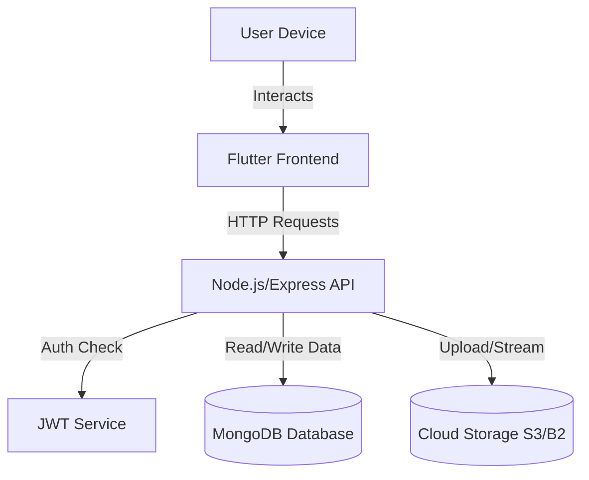

# Project Report: YouTube Clone Application

## 1. Project Overview and Objectives

### Purpose and Goal
The **YouTube Clone Application** is a full-stack video sharing platform designed to replicate the core functionalities of major video streaming services. The primary goal is to provide a seamless environment for users to upload, discover, and view video content, fostering a community of creators and viewers.

### Target Users
- **Content Creators**: Users who wish to upload videos and manage their channels.
- **Viewers**: Users looking for entertainment, education, or information through video content.

### Expected Outcomes
- A functional cross-platform mobile/web application built with Flutter.
- A robust backend API capable of handling user authentication, video data, and file storage.
- A responsive and intuitive user interface for video playback and interaction.

### Innovative Aspects
- **Cross-Platform Consistency**: Leverages Flutter to provide a uniform experience across Android, iOS, and Web.
- **Customizable Experience**: Includes a built-in theme switcher (Dark/Light mode) managed via a global state provider.

---

## 2. Problem Definition and Chosen Domain

### Problem Definition
In the digital age, there is an ever-growing demand for decentralized content sharing. While major platforms exist, building a custom solution allows for niche community targeting, data sovereignty, and specific feature tailoring without the constraints of algorithmic bias present in large-scale platforms.

### Domain Relevance
The project falls within the **Social Media and Video Streaming** domain. This domain is critical as video continues to dominate internet traffic. Understanding the architecture behind video streaming, data persistence, and high-concurrency user interactions is essential for modern software engineering.

### Scope and Limitations
**Scope:**
- User Authentication (Sign up, Login).
- Video Uploading and Playback.
- User Profiles and Settings.
- Search functionality.
- Commenting and interaction (likes/dislikes).

**Limitations:**
- Currently does not support live streaming.
- Video recommendation algorithms are basic compared to enterprise-level AI systems.

---

## 3. System Design and Architecture

### Architecture Overview
The application follows a **Client-Server Architecture** with a clear separation of concerns:

1.  **Frontend (Client)**: Built with **Flutter**, responsible for the UI/UX and user interactions.
2.  **Backend (Server)**: Built with **Node.js** and **Express**, handling API requests, business logic, and authentication.
3.  **Database**: **MongoDB** (via Mongoose) for storing user data, video metadata, and comments.
4.  **Storage**: Cloud storage (AWS S3 / Backblaze B2) for hosting actual video files and thumbnails.

### Diagram Description


### Justification
- **Flutter**: Chosen for its single codebase efficiency and high-performance rendering engine.
- **Node.js/Express**: Selected for its non-blocking I/O, making it ideal for handling multiple concurrent API requests typical in social apps.
- **MongoDB**: A NoSQL database was chosen for its flexibility in handling unstructured data like video metadata and nested comments.

---

## 4. Implementation Details

### Core Features & Implementation

#### 1. State Management
The Flutter frontend utilizes **Local State Management** via `setState` for handling UI interactions within individual screens, ensuring immediate feedback for user actions.

**Example: Login Screen State (`login_screen.dart`)**
The `LoginScreen` uses `setState` to manage the loading status during the authentication process, providing visual feedback to the user while the API call is in progress.
```dart
  void _login() async {
    setState(() => _isLoading = true); // Start loading
    final success = await _apiService.login(
      _emailController.text,
      _passwordController.text,
    );
    setState(() => _isLoading = false); // Stop loading

    if (success && mounted) {
      // Navigate to Home
    }
  }
```

#### 2. Backend API Structure
The backend is modularized by feature (User, Video, Auth). The entry point (`app.js`) aggregates these routes.

**Example: Server Setup (`app.js`)**
```javascript
import express from "express";
import videoRouter from "./videos/video.route.js";
// ... imports

const app = express();
connect(); // Database connection

app.use(cors());
app.use(json());

// Route definitions
app.use("/auth", authRouter);
app.use("/video", videoRouter);

app.listen(3500, () => {
  console.log("Server is running on port 3500");
});
```

#### 3. Data Storage
- **Database**: MongoDB is used via the `mongoose` ODM. Schemas are defined for Users, Videos, and Comments.
- **Local Storage**: The Flutter app uses `shared_preferences` to store simple key-value pairs, such as the user's authentication token or theme preference.

#### 4. External Packages
- **Frontend**:
    - `http`: For making REST API calls.
    - `video_player` & `chewie`: For rendering the video player UI.
    - `image_picker`: For selecting thumbnails/profile pictures.
- **Backend**:
    - `jsonwebtoken`: For secure authentication.
    - `multer`: For handling `multipart/form-data` (file uploads).
    - `aws-sdk` / `backblaze-b2`: For cloud storage integration.

---

## 5. Testing and Validation

### Testing Strategies
1.  **Unit Testing**: Testing individual functions (e.g., utility functions for date formatting).
2.  **Widget Testing**: Ensuring Flutter widgets render correctly under different states (e.g., loading vs. data loaded).
3.  **API Testing**: Verifying endpoints using tools like Postman to ensure correct JSON responses and status codes.

### Evidence
The project includes a `test` directory in the Flutter root for widget tests.
*Example of a simple widget test concept:*
```dart
testWidgets('Login screen has email field', (WidgetTester tester) async {
  await tester.pumpWidget(const MaterialApp(home: LoginScreen()));
  expect(find.byType(TextField), findsWidgets);
});
```

---

## 6. Challenges Faced and Lessons Learned

### Technical Challenges
- **State Synchronization**: Keeping the UI in sync with the backend (e.g., updating the "Like" count immediately after a user clicks it) required careful state management logic.
- **Video Buffering**: Implementing smooth video playback involves handling network latency. The `video_player` package helped, but optimizing video sizes for mobile was a learning curve.
- **CORS Issues**: Configuring Cross-Origin Resource Sharing (CORS) between the Flutter Web client and the Node.js server was initially tricky, resolved by properly configuring the `cors` middleware in Express.

### Lessons Learned
- **Modular Code**: Breaking the backend into `routes`, `controllers`, and `models` made debugging significantly easier than a monolithic file.
- **Async/Await**: Mastering asynchronous programming in both Dart (Futures) and JavaScript (Promises) was crucial for a responsive application.

---

## 7. Future Enhancements

1.  **Live Streaming**: Implementing WebRTC or RTMP support to allow users to broadcast live video.
2.  **Advanced Recommendations**: Using machine learning to suggest videos based on user watch history.
3.  **Push Notifications**: Integrating Firebase Cloud Messaging (FCM) to notify users of new comments or uploads from subscribed channels.
4.  **Performance Optimization**: Implementing lazy loading for video feeds (pagination) to reduce initial load times and data usage.

---

## 8. References and Acknowledgments

### Resources Used
- **Flutter Documentation**: For UI components and state management patterns.
- **Node.js & Express Docs**: For backend API construction.
- **MongoDB Manual**: For database schema design and queries.
- **Stack Overflow**: For troubleshooting specific errors (e.g., CORS, Multer configuration).

### Acknowledgments
- Thanks to the open-source community for maintaining packages like `provider`, `mongoose`, and `chewie`, which accelerated development significantly.